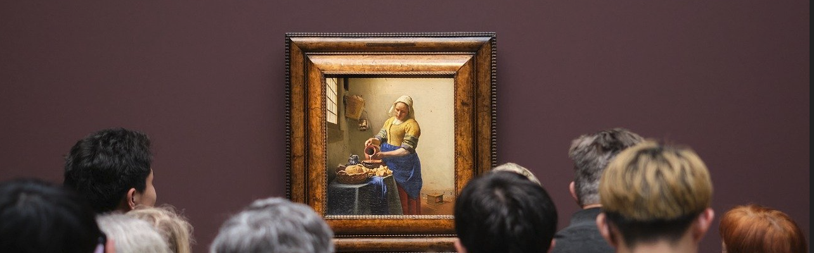

Introduction - I became interested in this dataset on the Tate Museum in London. I was curious as to what types of art are displayed there and also how diverse the art is. The dataset I came across contains metadata on both the artist and the art they created. Using these data, I planned a little exploratory analysis to see how varied and diverse the Tate is.

Link to Dataset: https://corgis-edu.github.io/corgis/csv/tate/ 

By Austin Cory Bart

Rows = 3,332

Columns = 18 *A column was split into 2 with use of Data Query!


```{r pressure, echo=FALSE, fig.cap="A caption", out.width = '100%'}

```


IMPORT DATA
```{r}
library(tidyverse)
library(ggplot2)
library(wordcloud)
tate_df <- read_csv("tate.csv")
```

```{r}
tate_df
```


ABOUT THE ARTISTS:

I started simple with my questions about the artists themselves. Because I am interested in diversity of the works in the Tate, I created a simple barplot with ggplot2 to ascertain the distributions of gender among the artists.

1. WHAT IS THE GENDER DISTRIBUTION OF THE ARTISTS REPRESENTED AT THE TATE?
```{r}

ggplot(data = tate_df, aes(y = artist.gender)) + 
  geom_bar(fill = "#C7E020FF") + 
  geom_text(stat='Count', aes(label=..count..), hjust=2) +
  ggtitle("Gender Distribution of Artists") + 
  xlab("Count") + ylab("Gender")

```

We have far more men than women represented in this dataset. Also, there are 49 with gender unspecified.

Another important question about the artists is where they were from. The dataset contained a column for birth location with city and country. I split the column on the comma delimiter using Data Query and decided to create a wordcloud of the new country column with the country names in proportion to the count of artists from that country. 

By far and away, the United Kingdom is most represented at the Tate, which is not very surprising. The next largest groups is the U.S. followed by Germany. However, there seem to be many countries represented if not in such a vast quantity.


2. WHERE ARE THE ARTISTS FROM?
```{r}

locations_df <- count(tate_df, artist.birth.location.2)

wordcloud(words = locations_df$artist.birth.location.2, freq = locations_df$n, min.freq = 1, scale=c(2, .5))

```


ABOUT THE ART:

After getting a quick sense about the artists (given what the data could provide), I decided to move on to the art itself. Probably the most obvious question is...

3. WHAT ARE THE MOST COMMON MEDIUMS OF ART?
```{r}

tate_df %>%
  count(data.medium) %>%
  slice_max(n, n = 5, with_ties = FALSE) %>%
  ggplot(aes(data.medium, n, fill= data.medium), show.legend = FALSE) + 
  scale_fill_viridis_d() +
  geom_col() +
  theme(legend.position = "none") +
  ggtitle("Top 5 Mediums") + 
  xlab("Medium") + ylab("Count")

```
I took a count from the medium column by unique entries and then parred my results down to the top five mediums. Looking at the raw dataset, one can see that there are many many mediums with some only having slight variation in differences such as what type of paper was used or how many of something was used. To get a quick sense of what a visit to the Tate would actually reveal, I took the most common mediums. 

There is also time-related data in the csv. Yearly information seemed a little too granular and century (though provided) a little too broad. So, I was drawn to the column representing which decade the work had been created in. Artwork is often represented by a larger time scale or period, so it seemed appropriate. 


4. WHICH DECADE IS MOST REPRESENTED?
```{r}

ggplot(tate_df[which(tate_df$`metadata.creation decade`>0),], aes(x= `metadata.creation decade`)) + 
  geom_histogram(binwidth=10, fill="#2A788EFF", color="#e9ecef") +
  ggtitle("Distribution of Creation in Decades") + 
  xlab("Year") + ylab("Count")

```
Using ggplot2 again, I plotted a histogram of works over all decade data provided from 1500 to 2010. It should be noted that I excluded any row with a decade value of zero as that is most likely missing data. This filter was added straight into the ggplot code instead of handled prior to plotting.

Also, while the histogram provides an easily perceived trend that quite a lot of the artwork originates from the twentienth century, it is difficult to actually see which decade is the one with the tallest bar. So, I also did a group by and summarize filter with decades sorted in descending order to get clarification. We can see that the 1970's is the decade with the most artwork below at 415 entries. Also, note that the second-highest number of entries is zero, which means there's a lot of missing data here.

```{r}
decades_df <- tate_df %>%
 group_by(`metadata.creation decade`) %>%
 summarise(
   count=n()
   )

decades_df <- decades_df[order(-decades_df$count),]

decades_df
```

So while the last question gave a sense of when the works were created, the dataset also allowed me to ask the question of when the artworks were acquired by the Tate.


5. WHAT IS THE TREND OF ARTWORK ACQUISITION OVER TIME?
```{r}

time_df <- tate_df %>%
 group_by(`metadata.acquisition date`) %>%
 summarise(
   count=n()
   )

ggplot(time_df, aes(x = `metadata.acquisition date`, y= count)) +
  geom_line(color="#69b3a2", size=1, alpha=0.9, linetype=1) +
  ggtitle("Acquisitions Over Time") + 
  xlab("Year") + ylab("Count")
  
```
Here I actually plotted a line graph or time series with ggplot2 again. I also quantified the years in a group by and summarize to set up the plot. It appears the Tate started acquiring works in the late 1840's all the way up to recent years. There is definitely a slightly upward trend and then a bump around 1975 which coincides with the previous discovery. And then finally there is a huge spike just before 2000 and then it drops back down again. We might speculate why the Tate went on two large buying sprees at these times.

Conclusion - This was a rather simple dataset, but it enabled me to ask WHO, WHERE, HOW, and WHEN in regards to both the artworks and the artists who created them. We can safely say that most of the artwork was created by those identified by the male gender. Most of the artists were from the United Kingdom with a moderate number of Americans and Germans. There are also many other countries shown, but not to the same extent. I also learned that most of the artwork is from the twentieth and nineteenth centuries. Painting, screenprinting, lithograph, and bronze are the most popular mediums. Finally, the acqusition timeline fairly matches the creation of the art itself and the Tate has been steadily acquiring more art over time. I feel I know what to expect now when I visit the Tate in London.


Resources:
Notebook Image https://pixabay.com/photos/crowd-painting-museum-exhibition-7810353/ Color Palette https://rpubs.com/mjvoss/psc_viridis WordCloud Starter Code https://stackoverflow.com/questions/27630791/using-r-to-create-a-frequency-word-cloud-using-just-a-column ggplot2 Starter Code http://www.sthda.com/english/wiki/ggplot2-title-main-axis-and-legend-titles, https://www.statmethods.net/management/sorting.html